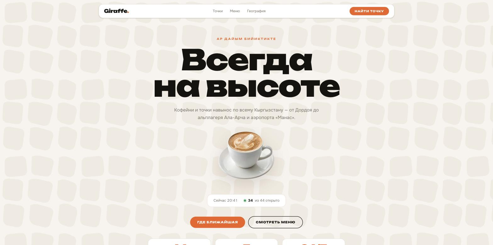
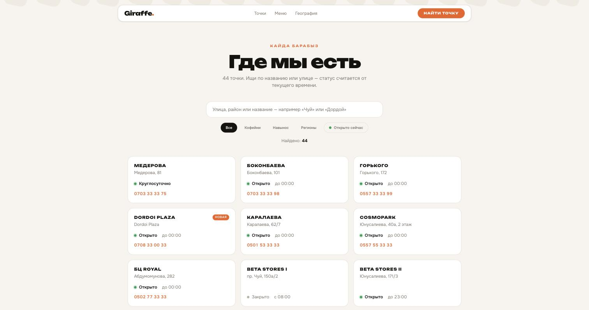
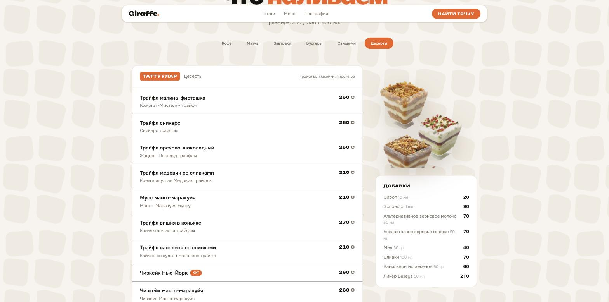
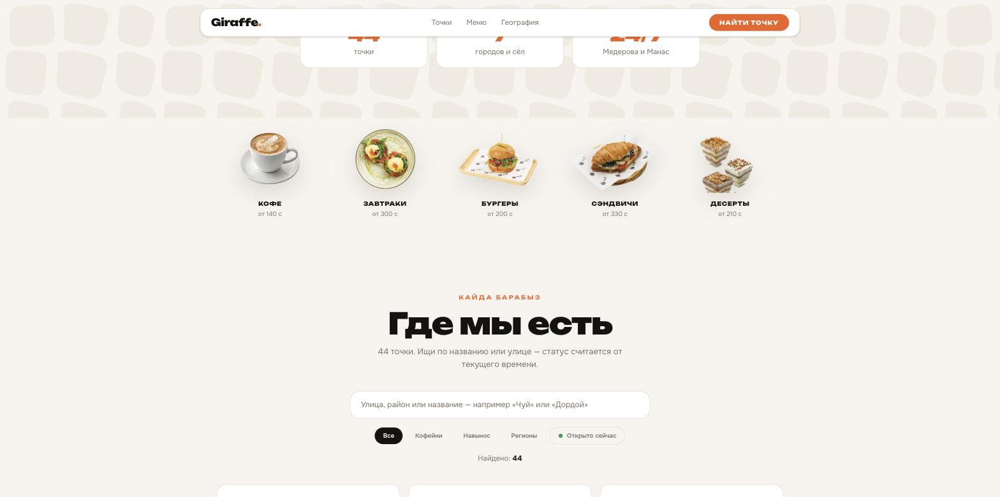
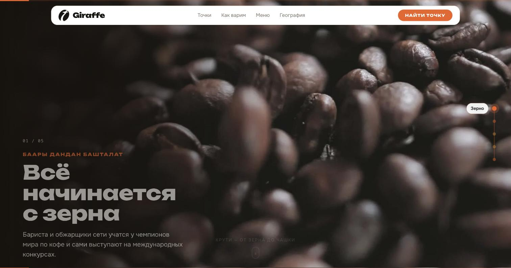

# Giraffe Coffee — концепт сайта

### 👉 [Живая демка](https://amanch1ik.github.io/giraffe-coffee-concept/)

Сайт для реальной сети кофеен в Кыргызстане, **у которой сайта нет**. Вместо него — taplink-простыня в Instagram-био, меню в виде PDF-ок на Google Sites, вакансии и франшиза на бесплатных поддоменах `tilda.ws`.

> **Это концепт, а не официальный сайт.** Учебная работа. Все данные — адреса, графики, телефоны, цены, фотографии — взяты из публичных источников самой сети и приведены **как есть, без выдумок**. Права на бренд, меню и фотографии принадлежат Giraffe Coffee.



---

## Задача

У сети **44 точки**: Бишкек, Токмок, Каракол, Балыкчы, Кара-Балта, Сокулук, аэропорт «Манас» (круглосуточно) и альплагерь Ала-Арча. Всё это опубликовано одним нечитаемым списком в taplink — без поиска, без фильтров, без ответа на единственный реальный вопрос гостя: **что открыто прямо сейчас и где ближайшая точка**.

Ядро сайта закрывает именно это.



**Живой статус.** Расписание каждой точки описано в минутах от полуночи с разбивкой на будни / субботу / воскресенье; статус считается от текущего времени и обновляется раз в 30 секунд. Круглосуточные точки и выходной день альплагеря — отдельные случаи в модели данных, а не хардкод в разметке.

```js
// locations.js
const std  = { wd: [H(7), H(23)], sat: [H(8), H(23)], sun: [H(8), H(23)] }
const late = { wd: [H(7), H(24)], sat: [H(8), H(24)], sun: [H(8), H(24)] }

export function status(loc, now = new Date()) {
  if (loc.open === null) return { open: true, always: true }   // 24/7
  const dow = now.getDay()
  if (loc.closedMon && dow === 1) return { open: false, closedToday: true }
  ...
}
```

Поиск по названию, улице и городу, фильтры по типу точки и переключатель «открыто сейчас» — всё считается на клиенте, без запросов.

**Карта и «рядом со мной».** 44 адреса прогнаны через Nominatim (OSM) — по одному запросу в секунду, с User-Agent, как требует их политика. Результаты провалидированы попаданием в рамку своего города: два улетели в другую область (Рысмендеева в Бишкеке нашлась под Караколом) и отброшены.

Итог — **37 точек из 44 с координатами**. Оставшиеся 7 в списке есть, но на карту не нанесены: адреса вроде «проход между 8-9 рядами» на Дордое не геокодируются, а выдумывать им место нельзя.

Кнопка «Рядом со мной» берёт геопозицию браузера, сортирует список по расстоянию (гаверсинус), показывает ближайшую и ставит метку. Клик по карточке наводит карту. Leaflet + тайлы OSM, без ключей и платных сервисов.

---

## Меню



**Тринадцать категорий, 130 позиций** — всё меню сети: кофе, матча, завтраки, салаты, боулы, супы, вторые с гарнирами, паста, бургеры, сэндвичи, выпечка, десерты и бар. Двуязычное, как в оригинале: кыргызская строка показывается только когда реально отличается от русской. Цены — из официального PDF-меню сети, в сомах; у напитков три значения, это размеры 250 / 350 / 450 мл.



Фотографии блюд — их собственная съёмка **с прозрачным фоном**. В PDF картинка и её альфа-маска лежат отдельными объектами, поэтому сначала я вытащил всё через `pdfimages`, а потом собрал RGBA обратно:

```python
im = Image.open(base).convert('RGB')
al = Image.open(mask).convert('L').resize(im.size)   # smask = альфа
im.putalpha(al)
```

Из 219 извлечённых объектов пригодными оказались 34, после отбора по контакт-листу в дело пошли 12. Части блюд (десерты, суп, паста, выпечка) масок в PDF не было — им сделал knockout заливкой от краёв (`knockout.py` из того же scroll-world).

Отдельная морока — гнутые кыргызские подписи, которые в макете обвивают тарелку: любой прямоугольный кроп их цепляет, а knockout оставляет как отдельные тёмные куски. Решилось обходом связных областей альфы: оставляем только крупные блоки, текст отваливается сам. Итог: блюда «летают» по кремовому фону без рамок, плашек и круглых масок — 356 КБ на всю съёмку в WebP.

---

## Глава «От зерна до чашки»



Кинематографичный пролёт по скроллу — та же техника, что у Apple: видео не играет само, его тайм-код привязан к позиции скролла. Пять сцен: зерно → обжарка на живом огне → помол → пролив эспрессо → чашка.

Движок — `scrub-engine.js` из [oso95/scroll-world](https://github.com/oso95/scroll-world) (MIT), футажи с [Mixkit](https://mixkit.co).

Глава стоит **после** блока поиска точки, а не в начале: главный вопрос гостя — «что открыто сейчас», и кино не должно его отодвигать.

---

## Арт-дирекшн

Палитра и фактура сняты **с их печатного меню**, а не придуманы: кремовая бумага `#f7f4ef`, near-black текст, оранжевые плашки заголовков `#f0611f` и подложка из жирафьих пятен.

Первая версия паттерна была набором ровных овалов — читалось как обои в горошек. После разбора реального меню стало видно, что мотив другой: **мозаика из скруглённых неправильных многоугольников** с широкими светлыми промежутками. Переписал по факту и увёл контраст почти в ноль (`#f1ebe1` на `#f7f4ef`) — работает как фактура бумаги, а не как картинка.

Типографика: **Unbounded** на заголовки, **Onest** на текст — обе с полноценной кириллицей.

---

## Стек

| Слой | Технология |
|---|---|
| Сборка | Vite + React 19 |
| Стили | Tailwind CSS v4 (CSS-first) |
| Анимация | [Motion](https://motion.dev) 12 — `layoutId`-пилюли, layout-анимация списка |
| Плавный скролл | [Lenis](https://lenis.darkroom.engineering) |
| Пролёт камеры | `scrub-engine.js` из [oso95/scroll-world](https://github.com/oso95/scroll-world) (MIT) |

```bash
npm install
npm run dev
npm run build
```

---

## Инженерные заметки

### Контент не должен зависеть от того, доиграла ли анимация

Ключевой блок с живым статусом сети залипал на `opacity: 0` — на странице была пустота вместо главной информации.

Диагностика показала кое-что важнее самого бага:

```js
{ rafFrames: 0, waapiWorked: "0", animations: 9 }
```

`requestAnimationFrame` вообще не тикал — при этом Motion честно поставил 9 анимаций в очередь. Причина оказалась не в коде: Chrome троттлит фоновые и перекрытые вкладки, а без rAF не двигается ни Motion, ни Lenis, ни нативный WAAPI. То есть сайт был исправен, а замер — нет.

Но вывод остаётся в силе: **если анимация по любой причине не стартует, контент обязан быть виден**. Поэтому entrance-анимации двигают только `transform` и не трогают прозрачность:

```jsx
initial={{ x: -14 }} whileInView={{ x: 0 }}   // без opacity: 0
```

Прозрачностью анимируется только то, что не несёт информации.

### Мобильная вёрстка

Проверял в настоящем 390×844 через iframe-стенд, а не ресайзом окна: инструмент ресайза врал (`innerWidth` оставался 1920 при `outerWidth` 784).

Что поправилось по итогам замеров: цена в позиции меню уезжает под название (в две колонки текст рвался на 3-4 строки при полупустой колонке цены), категории едут горизонтальным скроллом вместо переноса на две строки, кнопки героя получают общую ширину, паттерн мельчает до 190px — на 390px тайл в 300px занимал почти всю ширину и читался как крупные пятна, а не фактура. Горизонтального оверфлоу нет.

### Движок пролёта рассчитан быть страницей целиком

Апстрим считает, что трек начинается на самом верху документа — `s.start = off * vh` и сравнение с абсолютным `window.scrollY`. У нас глава в середине страницы, поэтому пришлось патчить отсчёт (патчи помечены `// [GIRAFFE patch]`):

```js
track.style.height = '0px'                                    // иначе трек сам себя смещает
base = track.getBoundingClientRect().top + window.scrollY
SEGMENTS.forEach(s => { s.start = base + off * vh; ... })
```

Второе следствие: все слои движка — `position: fixed`, и внутри обычной страницы они висят над остальным контентом. В соседнем проекте хватило гасить их после главы; здесь пришлось гасить **и до** — иначе тёмное небо накрывало герой и поиск точки.

### `* { margin: 0 }` вне слоя ломает `mx-auto`

Грабли из соседнего проекта, здесь обойдены заранее. Утилиты Tailwind v4 лежат в `@layer utilities`, а **неслоёный CSS всегда бьёт слоёный** — поэтому привычный сброс `* { margin: 0 }` молча выключает центрирование по всему сайту. Reset уже делает preflight в `@layer base`; отдельный `*` не нужен.

---

## Данные

| Что | Источник |
|---|---|
| Адреса, графики, телефоны 44 точек | [taplink сети](https://taplink.cc/giraffecoffeebishkek) |
| Меню и цены | официальное PDF-меню с их Google Sites |
| Фотографии блюд | оттуда же |
| Логотип (зерно-жираф) и фирменный паттерн | обложка того же PDF, вырезаны с прозрачностью |
| Слоган, соцсети, контакты | [@giraffe_coffee](https://instagram.com/giraffe_coffee) |
| Футажи главы-пролёта | [Mixkit](https://mixkit.co), Mixkit Free License |

---

## Что не сделано

- **7 точек без координат** — Дордой, Альплагерь, Cosmopark, ТЦ Ала-Арча, Beta Stores I, Браво, Дордой-2. Нужны либо точные адреса, либо выгрузка координат от самой сети.
- **Онлайн-заказ и доставка.** Сейчас у сети это живёт в агрегаторах.

---

## Лицензия

Код — MIT. Бренд, меню и фотографии принадлежат Giraffe Coffee и использованы в учебном концепте.
